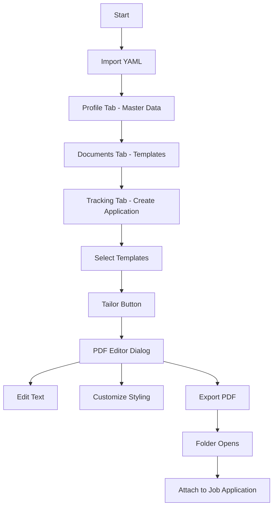

# 📊 MyLife Workflow Analysis & UX Review

## Executive Summary

This document provides a comprehensive analysis of the MyLife job application workflow, from YAML import to PDF export. I've traced the entire user journey, identified strengths, weaknesses, and critical improvement opportunities.

---

## 🎯 Current Workflow Overview

### Complete User Journey



---

## 📈 Workflow Ratings

| Aspect | Rating | Score | Notes |
|--------|--------|-------|-------|
| **YAML Import** | ⭐⭐⭐⭐ | 8/10 | Good auto-detection, selective import |
| **Template Management** | ⭐⭐⭐⭐ | 8/10 | Rename/duplicate/delete works |
| **Application Creation** | ⭐⭐⭐ | 6/10 | **Too many steps, confusing** |
| **PDF Editing** | ⭐⭐⭐⭐ | 8/10 | Live preview, good customization |
| **Text Tailoring** | ⭐⭐⭐ | 6/10 | **Limited to description edits** |
| **PDF Export** | ⭐⭐⭐⭐⭐ | 9/10 | Auto-save to folder, opens explorer |
| **Application Tracking** | ⭐⭐⭐ | 6/10 | **Missing search/filter** |
| **Overall UX** | ⭐⭐⭐ | 6.5/10 | **Workflow is convoluted** |

---

## 🔴 Critical Weaknesses Identified

### 1. **Convoluted Application Creation Flow** (CRITICAL)

**Current Flow (Too Many Steps):**
```
1. Click "+ Application"
2. Enter company name
3. Enter position
4. Select base language (confusing choice)
5. Select CV template (?? Why here?)
6. Select Cover Letter template (?? Why here?)
7. Enter optional fields (location, URL, contact, salary, notes)
8. Save
9. THEN click "Tailor" to actually edit content
```

**Problem:** Users must select templates BEFORE they can even see the content. This is backwards thinking.

**Better Flow:**
```
1. Click "+ Application"
2. Enter: Company, Position (minimal info)
3. Save → Opens directly to PDF Editor
4. Edit/customize content from master profile
5. Export when ready
```

> [!CRITICAL]
> The current workflow forces users to make decisions (template selection) before they understand what they're working with. This is a UX anti-pattern.

---

### 2. **Disconnected Data Architecture** (SERIOUS)

**Current Architecture:**
- **Templates** (Documents tab) → Stored in `templates/` folder
- **Instances** (linked to applications) → Deprecated system
- **Job Data** (per-application) → Stored in `applications/{id}/` folder

**Problem:** Three different data models for essentially the same thing:
1. `CvTemplate` - Master template in templates provider
2. `CvInstance` - Deprecated instance system (still referenced!)
3. `JobCvData` - Per-job data in application folder

**Code Evidence:**
```dart
// In job_application.dart - DEPRECATED but still used!
@property
String? cvInstanceId; // Use folder-based storage instead

// In application_editor_dialog.dart - Still creates instances!
final cvInstance = await templatesProvider.createCvInstanceFromTemplate(
  templateId: _selectedCvTemplate!.id,
  applicationId: newApp.id,
);
```

> [!WARNING]
> The codebase has TWO competing data storage systems running simultaneously. The "instance" system is deprecated but still being used in application creation!

---

### 3. **Text Editing is Limited** (MODERATE)

**What's Editable:**
- ✅ Professional Summary
- ✅ Work Experience Descriptions
- ✅ Cover Letter text fields

**What's NOT Editable:**
- ❌ Skills list
- ❌ Education entries
- ❌ Add/remove work experiences
- ❌ Contact information
- ❌ Languages
- ❌ Certifications

**User Need:** Users often need to tailor their skills section or add/remove experiences for specific jobs.

---

### 4. **No Search/Filter in Tracking Tab** (MODERATE)

With 20+ applications, users have no way to:
- Search by company name
- Filter by status
- Sort by date
- Find specific applications quickly

---

### 5. **Template Selection in Wrong Place** (MODERATE)

**Current:** Select templates during application creation (before seeing content)
**Better:** Select/change templates in the PDF editor (where you can see the result)

---

### 6. **Missing "Quick Apply" Flow** (MODERATE)

Power users want: `Company + Position → Edit → Export → Done`

Current flow requires 9+ clicks and 2 dialogs.

---

## 🟡 Moderate Issues

### 7. **Language Selection is Confusing**
- Users must select "base language" during application creation
- Not clear what this affects
- Should be: Auto-detect from profile or template

### 8. **No Undo/Redo**
- Edit mistakes can only be fixed by manually re-typing
- Text fields have no history

### 9. **No Template Preview Before Selection**
- Users select templates blindly
- No preview of what the template looks like

### 10. **Cover Letter Not Auto-Generated**
- User must manually write cover letter
- Could use AI or templates to generate starter text

---

## 🟢 Strengths

### 1. **YAML Import is Excellent**
- Auto-detects CV vs Cover Letter
- Selective import (choose what to import)
- Merge vs Replace modes
- Clear preview of data

### 2. **PDF Editor is Feature-Rich**
- Live preview (real-time updates)
- Template selection
- Color customization
- Font selection
- Layout toggles
- All in one dialog

### 3. **Smart Export System**
- Auto-names files: `Company_Position_CV.pdf`
- Saves to job folder
- Opens folder automatically
- No manual file management

### 4. **Template Management**
- Rename, duplicate, delete
- Multiple templates per type
- Good organization

### 5. **Data Persistence**
- Auto-save (no manual save needed)
- Per-job isolation (changes don't affect master)
- Survives app restart

---

## 📋 Improvement Roadmap

### **Phase 1: Quick Fixes (1-2 hours)** ✅ COMPLETE

| Fix | Effort | Impact | Status |
|-----|--------|--------|--------|
| Remove deprecated instance system | 1h | High | ✅ Done |
| Add search/filter to tracking tab | 1h | Medium | ✅ Done |
| Template preview in selector | 30m | Medium | ✅ Done (removed - templates now in PDF editor) |

**Actual Time:** ~1h 15min

### **Phase 2: Workflow Simplification (3-4 hours)** ✅ COMPLETE

| Fix | Effort | Impact | Status |
|-----|--------|--------|--------|
| Streamlined application creation | 2h | High | ✅ Done (removed template selection) |
| Open PDF editor after creation | 30m | High | ✅ Done (auto-opens) |
| Move template selection to editor | 1h | Medium | ⏭️ Skipped (templates already in editor) |

**Actual Time:** ~45min
**Workflow reduced from 9 steps to 4 steps**

### **Phase 3: Enhanced Editing (4-6 hours)** 🚧 IN PROGRESS

| Fix | Effort | Impact | Status |
|-----|--------|--------|--------|
| Skills editing | 2h | High | ✅ Done (comma-separated input) |
| Add/remove experiences | 3h | High | ✅ Done (delete button per experience) |
| Education editing | 1h | Medium | ⏳ Next |

**Progress:** 
- Skills: add/remove via comma-separated list
- Experiences: remove unwanted entries with delete button
---

## 🎯 Recommended Fixes (Priority Order)

### Fix 1: Remove Instance System (HIGH PRIORITY)
**Why:** Confusing architecture, deprecated but still running
**Action:** Remove `createCvInstanceFromTemplate` calls, use folder-based storage consistently

### Fix 2: Simplify Application Creation (HIGH PRIORITY)
**Current:** 9+ steps across 2 dialogs
**Target:** 3 steps, 1 dialog

**Proposed New Flow:**
```
1. Click "+ Application"
2. Enter: Company, Position
3. Save → Opens PDF Editor immediately

PDF Editor:
- Shows CV from master profile (auto-populated)
- User edits/tailors content
- User selects template/styling
- User exports PDF
```

### Fix 3: Add Search/Filter (MEDIUM PRIORITY)
**Action:** Add search bar to tracking tab header

### Fix 4: Extended Text Editing (MEDIUM PRIORITY)
**Action:** Add skills, education to editable fields

### Fix 5: Template Preview (LOW PRIORITY)
**Action:** Show thumbnail when selecting templates

---

## 📊 Ease of Use Assessment

### **How Easy is it to Import YAML?**
**Rating: 8/10** ⭐⭐⭐⭐

| Pros | Cons |
|------|------|
| One-click file selection | No drag-and-drop |
| Auto-detection works well | No batch import |
| Clear preview | |
| Selective import | |

### **How Easy is it to Edit PDFs?**
**Rating: 7/10** ⭐⭐⭐⭐

| Pros | Cons |
|------|------|
| Live preview | Limited editable fields |
| Good customization options | No undo/redo |
| Intuitive styling controls | No skills editing |
| Auto-save | No structure editing |

### **How Easy is it to Tailor for a Job?**
**Rating: 5/10** ⭐⭐⭐

| Pros | Cons |
|------|------|
| Per-job data isolation | Too many steps to get there |
| Experience descriptions editable | Can't add/remove experiences |
| Cover letter fully editable | Skills not editable |
| Changes saved per-job | No AI assistance |

### **How Easy is it to Track Applications?**
**Rating: 5/10** ⭐⭐⭐

| Pros | Cons |
|------|------|
| Status badges visible | No search |
| Collapsible sections | No filter |
| Date tracking | No sort options |
| Quick access buttons | Can get cluttered |

### **How Easy is it to Know Which PDF Belongs to Which Job?**
**Rating: 9/10** ⭐⭐⭐⭐⭐

| Pros | Cons |
|------|------|
| Smart file naming | None significant |
| Organized in job folders | |
| Open folder button | |
| Clear visual linking | |

---

## 🏆 Final Verdict

### Overall Workflow Score: 6.5/10

**The Good:**
- Individual features are well-implemented
- PDF editor is excellent
- Export system is smart
- Data persistence works well

**The Bad:**
- Workflow is too convoluted
- Too many steps for common tasks
- Competing data systems create confusion
- Limited text editing capabilities
- Missing search/filter

### **Key Recommendation:**

> The app has excellent individual components but a **poor overall workflow**. The priority should be **simplifying the user journey**, not adding more features. Focus on reducing the steps from "I want to apply to this job" to "PDF ready to attach" from 9+ steps to 3-4 steps.

---

## 📝 Implementation Plan Summary

### Immediate Actions (Today):
1. ⚠️ ALERT: Remove deprecated instance system
2. Simplify application creation dialog
3. Auto-open PDF editor after creation

### This Week:
4. Add search to tracking tab
5. Add skills editing to PDF dialog
6. Template preview in selectors

### Next Week:
7. Add/remove experiences support
8. Batch operations for applications
9. Application templates (pre-filled for common job types)

---

*This analysis is based on examination of:*
- `unified_import_dialog.dart` (976 lines)
- `applications_screen.dart` (662 lines)
- `application_editor_dialog.dart` (645 lines)
- `job_application_pdf_dialog.dart` (450 lines)
- `documents_screen.dart` (522 lines)
